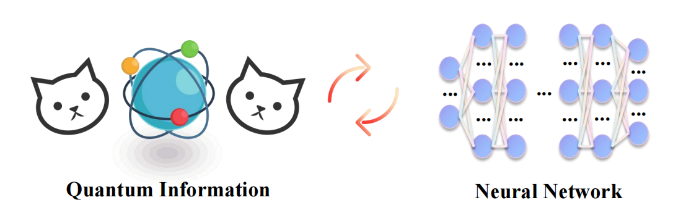
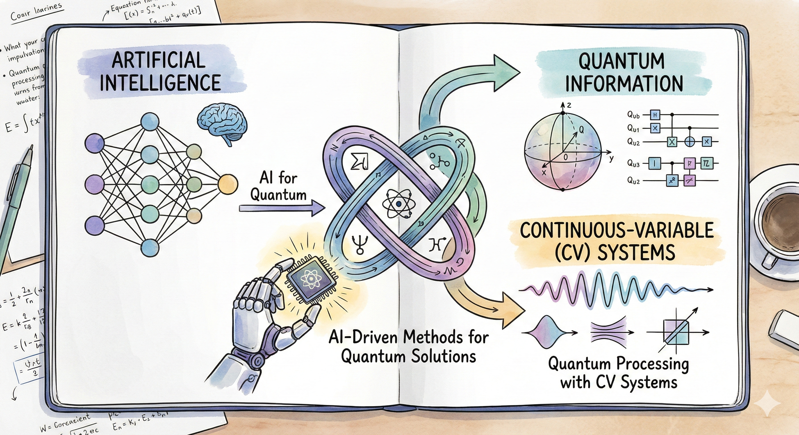

  
  
  

## 👨‍🎓 About Me

I am **Xinyu Tang (汤欣宇)**, a first-year Ph.D. student at the [School of Computer Science](https://www.cs.sjtu.edu.cn/en/), **Shanghai Jiao Tong University (SJTU)**. 

Prior to this, I received my B.E. degree from the School of Software, **Shandong University (SDU)** in June 2025.

I am fortunate to be advised by [**Prof. Ya-Dong Wu**](https://yadong101.github.io).

## 🔬 Research Interests

My research sits at the exciting intersection of **Artificial Intelligence** and **Quantum Information**. I am particularly interested in:

* 🤖 **AI for Quantum:** Researching AI-driven methods to solve quantum information problems.
* 💻 **Continuous-variable (CV) Systems:** Studying quantum information processing with CV systems.

  

  

---

## 🔥 News
* **[Sept. 2025]** Started my Ph.D. journey at SJTU! 🚀
* **[June 2025]** Graduated from Shandong University with a Bachelor's degree. 🎓
* **[May 2024]** One paper accepted to **AAMAS 2024** (Oral)! 🎉

---

## 📝 Publications

1.  **Towards Efficient Auction Design with ROI Constraints**
      **Xinyu Tang**, Hongtao Lv, Yingjie Gao, Fan Wu, Lei Liu, Lizhen Cui.
      *Proceedings of the 23rd International Conference on Autonomous Agents and Multiagent Systems (**AAMAS 2024**)*, Auckland, New Zealand. (CCF-B, **Oral**)
      [Undergraduate research advised by Prof. Hongtao Lv and Prof. Lei Liu]
      
    
---

## 🏆 Honors & Awards

| Year | Award |
| :--- | :--- | 
| 2024 | **National Scholarship** | 
| 2022 | **National Scholarship** |

---

    
<i>Thanks for visiting my profile! 🚀</i>

    
<i>Feel free to reach out via email for collaboration.</i>

